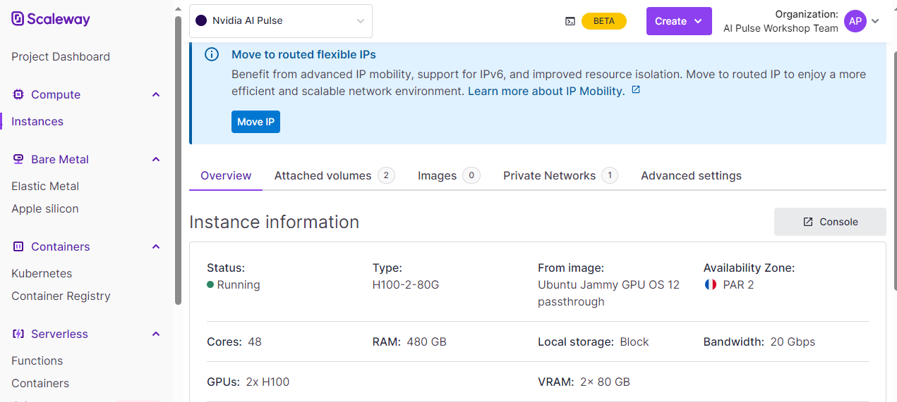
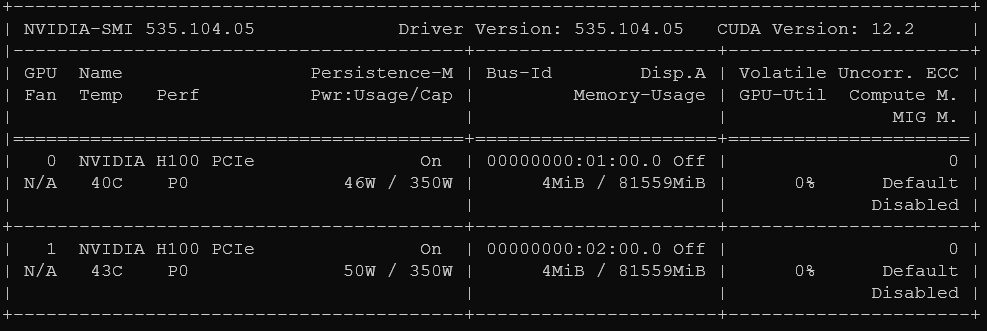

# TensorRT-LLM demo Scaleway ai:PULSE

### Workshop's Objectives
This workshop is a step-by-step guide to compile Llama2 models using [TensorRT-LLM](https://github.com/NVIDIA/TensorRT-LLM) for an optimized and efficient execution. We also use [Triton Inference Server](https://developer.nvidia.com/triton-inference-server) and [TensorRT-LLM Backend](https://github.com/triton-inference-server/tensorrtllm_backend) to deploy the engines generated by TensorRT-LLM. 

### Hardware 
We are using a H100-2-80G [instance](https://console.scaleway.com/instance/servers/fr-par-2/ae282180-5672-40f8-8eee-193508629a1b/overview) provided by Scaleway.

For reference, the following is the `nvidia-smi` output.

### Getting Started
Let's start by setting-up your environment and downloading Llama2 weights are explained in [00_Setup](./aiPULSE_workshop/00_Setup.md) and [01_Models](./aiPULSE_workshop/01_Models.md) files.
