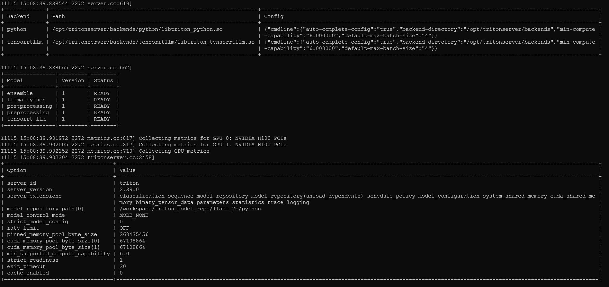

# Serving with Triton Inference Server

## Models Repository 
Before launching Triton Inference Server, we need to prepare the models repository beforehand and it should respect the strucutre below. For further details on the model repository in Triton Inference server please refer to this [documentation](https://docs.nvidia.com/deeplearning/triton-inference-server/user-guide/docs/user_guide/model_repository.html).
```bash
<model-repository-path>/
  <model-name>/
    [config.pbtxt]
    <version>/
      <model-definition-file>
    <version>/
      <model-definition-file>
    ...
  <model-name>/
    [config.pbtxt]
    <version>/
      <model-definition-file>
    <version>/
      <model-definition-file>
    ...
```

For this step of the demo, we consider 2 implemenations based on Llama2 7B to compare different backends in Triton.  
### Python Model - HF Llama model 
We will serve one reference model called *llama_python*, using Hugging Face Text Generation Pipeline and Triton Python Backend.
The python inference code is described in `llama-python/1/model.py`. 
The Text Generation Pipeline includes the tokenization, the inference on the model and the text decoding process. 


```
root@nvidia-workshop-gpu-instance:/workspace$ tree triton_model_repo/llama_7b/python/llama-python/
triton_model_repo/llama_7b/python/llama-python/
├── 1
│   └── model.py
└── config.pbtxt
```
### TensorRT-LLM Model - Triton Ensemble 
 An ensemble model represents a pipeline of one or more models and the connection of input and output tensors between those models. Read more about [ensembles](https://docs.nvidia.com/deeplearning/triton-inference-server/user-guide/docs/user_guide/architecture.html#ensemble-models).

Our pipeline for TensorRT-LLM model serving in Triton comprises 4 components :

- `preprocessing`: tokenize the input text (Python Backend)

- `tensorrtllm`: infer the TRTLLM engine (TensorRT- LLM backend)

- `postprocessing`: decode the text output (Python Backend) 

- `ensemble` folder describing the Inputs/Outputs and the sequence of models to call during inference. 

When querying the TensorRT-LLM model, we will query only the "ensemble" which is responsible for all the pipeline. The folder's structure should be similar to the following :

```
root@nvidia-workshop-gpu-instance:/workspace$ tree triton_model_repo/llama_7b/fp16/no-inflight/
triton_model_repo/llama_7b/fp16/no-inflight/
├── ensemble
│   ├── 1
│   └── config.pbtxt
├── postprocessing
│   ├── 1
│   │   └── model.py
│   └── config.pbtxt
├── preprocessing
│   ├── 1
│   │   └── model.py
│   └── config.pbtxt
└── tensorrt_llm
    ├── 1
    └── config.pbtxt
```
For simplicity in this particular experiment, the `llama-python` folder resides at the same level as the TensorRT-LLM components described above. Thus, the model repository should be similar to the following snippet. But, this is **not** recommended for production runs. 
```
root@nvidia-workshop-gpu-instance:/workspace$ tree -d -L 1 triton_model_repo/llama_7b/python/
triton_model_repo/llama_7b/python
├── ensemble
├── llama-python
├── postprocessing
├── preprocessing
└── tensorrt_llm
```

## Inferencing using Triton Inference Server

Two steps are needed. We first need to launch the server and then we can send requests via a client.

### Launch the Server
For single GPU usage: 
```bash
tritonserver --model-repository=/workspace/triton_model_repo/llama_7b/python
```

If you built the engine with `--world_size X` where `X` is greater than 1, you will need to use the [launch_triton_server.py](https://github.com/triton-inference-server/tensorrtllm_backend/blob/release/0.5.0/scripts/launch_triton_server.py) script.

```bash
cd /workspace/tensorrtllm_backend/
python3 ./tensorrtllm_backend/scripts/launch_triton_server.py --world_size=X --model_repo=/workspace/triton_model_repo/llama_7b/python
#Note: to kill the server... kill the "triton" running processes
```
The server is ready when all the models' status are `READY`. The output should be similiar to this screenshot : 




### Send Requests from a Client
 
Once the server is running, we can send requests. Many possible methods exists, but, for our example we will use the Triton Docker client available on [NVIDIA NGC](https://catalog.ngc.nvidia.com/orgs/nvidia/containers/tritonserver).

```bash
docker run -it --net=host -v /data:/workspace nvcr.io/nvidia/tritonserver:23.10-py3-sdk bash
```
Inside the container, you need to install some packages using the following command.
```
cd /workspace/tensorrtllm_backend
pip install -r requirements.txt
pip install sentencepiece
```

## Sending requests

We will use the provided client script [end_to_end_streaming_client.py](./scripts/end_to_end_streaming_client.py) to send requests to our server using the Python and TensorRT-LLM models.

### Python Model

```bash
cd /workspace/tensorrtllm_backend/
python ./tools/python_backend/end_to_end_streaming_client.py \
      --model_name llama-python \
      --max_tokens 100 \
      --prompt "I am going to "
```

```
b'I am going to 100% agree with you.\nI am not sure if you are aware of this, but the reason why the US is so far behind in the development of the electric car is because of the oil companies. They have been lobbying the government to not allow the development of electric cars.\nI am not sure if you are aware of this, but the reason why the US is so far behind in the development of the electric car is because of the oil companies. They have been'
```

### TensorRT-LLM Model


```bash
cd /workspace/tensorrtllm_backend/
python ./tools/python_backend/end_to_end_streaming_client.py \
      --model_name ensemble \
      --max_tokens 100 \
      --prompt "I am going to "
```

```
b'<s>I am going to 100% agree with you on this one. I have been a fan of the show since the beginning and I have to say that I am not a fan of the new season. I think that the show has lost its way and that it is no longer the same show that it was when it first started. I think that the show has become too much of a soap opera and that it is no longer the same show that it was when it first started. I think that the show has'
```

## Performance Comparison

In this section, we compare both model's performance on a subset of the [CNN Dailymail Dataset](https://huggingface.co/datasets/cnn_dailymail). We rely on [MLPerf Inference Benchmark Suite](https://github.com/mlcommons/inference/tree/master/language/gpt-j)) to generate `cnn_eval.json` file following these steps.

```bash
git clone https://github.com/mlcommons/inference.git
cd inference
cd language/gpt-j/
pip install simplejson
python download_cnndm.py
```

To evaluate the inference time of each of our runs, we only use few promtps from `cnn_eval.json`. The truncated file is called `mini_cnn_eval.json` and has the following structure.


```
[
  {
      "input": "(CNN)Share, and your gift will be multiplied. That may sound like an esoteric adage, but when Zully Broussard selflessly decided to give one of her kidneys to a stranger, her generosity paired up with big data. It resulted in six [...] "",
      "instruction": "Summarize the following news article:",
      "output": "Zully Broussard decided to give a kidney to a stranger .\nA new computer program helped her donation spur transplants for six kidney patients ."
  },
  ....
]    
```

The [identity_test_python_vs_trtllm.py](./scripts/identity_test_python_vs_trtllm.py) script will measure the total latency on multiple asynchronous request sent to the models: 

**Lauching using Python backend**
```bash
python ./tools/python_backend/identity_test_python_vs_trtllm.py --max_input_len 100 --dataset ./tools/dataset/mini_cnn_eval.json -i grpc --model_name "llama-python" -u 192.168.1.3:8001
```
```bash
[INFO] Warm up for benchmarking.
[INFO] Start benchmarking on 4 prompts.
[INFO] Total Latency: 1998.262 ms
```
**Launching using TensorRT-LLM ensemble** 
```bash
python ./tools/python_backend/identity_test_python_vs_trtllm.py --max_input_len 100 --dataset ./tools/dataset/mini_cnn_eval.json -i grpc --model_name "ensemble" -u 192.168.1.3:8001
```
```bash
[INFO] Warm up for benchmarking.
[INFO] Start benchmarking on 4 prompts.
[INFO] Total Latency: 659.28 ms
```

The speedup when TensorRT-LLM is used compared to the Python baseline in our example is **3**. We still can improve this speedup with other optimizations. 

## Next Step
[Parallelism in TensorRT-LLM](04_Parallelism.md)
