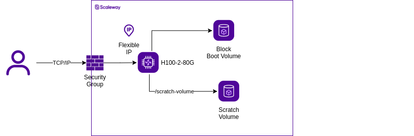
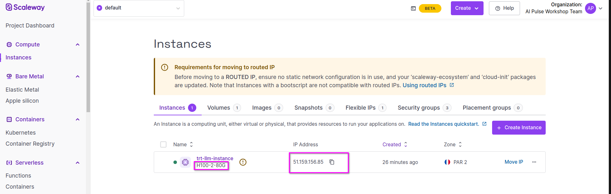
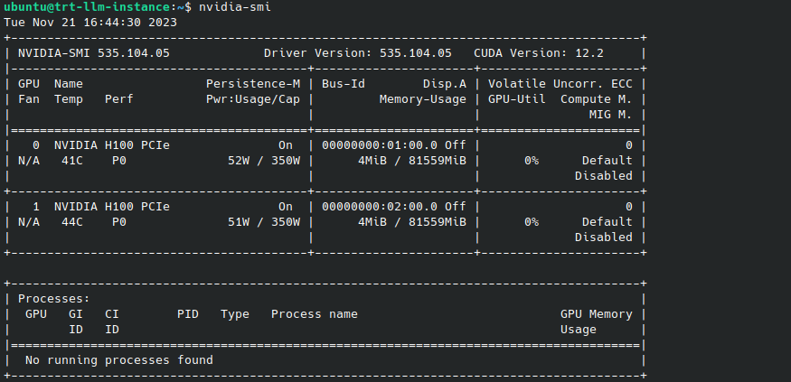
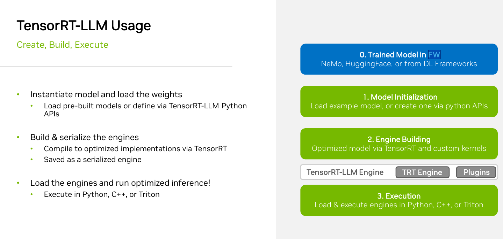

# Setup
## Prerequisites
- Scaleway Account with the following
  - Quotas (cp_servers_type_H100_2_80G) enabled for H100-PCIE 
  - IAM Token with at least permissions below :
    - InstancesFullAccess
  - SSH Keys defined at project Level. See [here](https://www.scaleway.com/en/docs/console/project/how-to/create-ssh-key/)
- Terraform >= 1.3.X See [here](https://www.terraform.io/downloads.html).

## Disclaimer
Components and architecture deployed here have been deployed in the context of training. This is not a production ready deployment as it is lacking some security features like VPC integration.

**Cost** : *Price of H100*2GPU (5.76675/hour - 31/12/2023)*
# Infrastructure Layer
## Deployment
1. Configure your environment variables, so that Scaleway terraform providers can interact with Scaleway backbone :
   - SCW_ACCESS_KEY
   - SCW_SECRET_KEY
   - SCW_DEFAULT_PROJECT_ID
   - SCW_DEFAULT_ORGANIZATION_ID

  See [here](https://registry.terraform.io/providers/scaleway/scaleway/latest/docs#environment-variables) for more details.

2. Configure your terraform variables by renaming the infrastructure/sources/terraform.tfvars.template -> sources/infrastructure/terraform.tfvars
- Update the users_ips_lists that is used to restrict  access to your instance to a list of IP.

 You can set this value at 0.0.0.0 to grant access whatever the IP.

3. Deploy the infrastructure using the command below
```
terraform -chdir=sources/infrastructure init &&  terraform -chdir=sources/infrastructure apply
```
- This script will rely on terraform to deploy an **H100-2-80G** that will be reached using SSH connection.
- A root volume of 500 GB will be deployed and a [scratch volume](https://www.scaleway.com/en/docs/compute/gpu/how-to/use-scratch-storage-h100-instances/)(i.e. :  NVMe disks which are fine-tuned for high-speed data access) of 3.9 Tb will be added to this instance.
- The Scratch volume will be automatically mount on **/scratch** mountpoint that will be used to store datasets further.


## Validation
Here we will show how you can connect to the Instance and validate that the 
1. Connect to your Scaleway Console 
2. Retrieve your instance public ip from the console

3. Connect to your instance using ssh client
```
ssh root@$PUBLIC_IP
```
4. Validate that you have the right configuration (2*H100-PCIE) and right drivers using the nvidia-smi command
```
nvidia-smi
```


# Software Layer
## Description
As explained before, TensorRT-LLM will be used within Triton Inference Server to deploy the engines it has generated.
In this chapter, we will explain how to deploy TensorRT-LLM backend within the Triton Inference Server and also how to get the TensorTRT Toolbox.

## Prerequisites
The first thing to do here is to clone the git repository associated to this tutorial in your VM.

 It will be used to get files (Dockerfile, python script) needed as part of this tutorial.
```
git -C /scratch clone https://github.com/scaleway/ai-pulse-nvidia-trt-llm.git
```
## Triton Inference Server
We will use here the [official docker image](https://catalog.ngc.nvidia.com/orgs/nvidia/containers/tritonserver) provided by Nvidia .


## TensorRT-LLM
### Usage overview


### Setup
We could have downloaded directly TRT-LLM from the [official github repository](https://github.com/NVIDIA/TensorRT-LLM) however because we will rely on Triton , we will directly download it from [TensorRT-LLM backend repository](https://github.com/triton-inference-server/tensorrtllm_backend.git) on which it is added as submodules.

1. Clone the repository on the scratch volume
```
git -C /scratch clone https://github.com/triton-inference-server/tensorrtllm_backend.git  
```
2. Download Tensor RT LLM through the Git modules
```
cat <<'EOF'> /scratch/tensorrtllm_backend/.gitmodules 
[submodule "tensorrt_llm"]
        path = tensorrt_llm
        url = https://github.com/NVIDIA/TensorRT-LLM.git
EOF
```
```
git  -C /scratch/tensorrtllm_backend submodule update --init --recursive 
git  -C /scratch/tensorrtllm_backend lfs install
git  -C /scratch/tensorrtllm_backend lfs pull  
```


### TensorRT-LLM Backend integration in Triton
#### Server
At the moment of writing this document, triton docker image does not yet contains all the resources required to  launch TRT-LLM builded model.
We will built a new docker image based on the official triton image
 using the script below : 

1. Build the docker image
```
docker build -t tritonserver-aipulse:23.10 -f /scratch/ai-pulse-nvidia-trt-llm/sources/triton/docker/server/Dockerfile .
```

 Scaleway H100 instances are provided with docker pre-installed .

Associated Dockerfile is located [here](../sources/triton/docker/server/Dockerfile)

#### Client
To make an inference request to Triton Inference Server, we send HTTP or gRPC request to server endpoint.
Triton offers some [Client libraries](https://github.com/triton-inference-server/client) that ease these interactions, we bundles these library using a docker image.

1. Build the docker client image
```
cd /scratch/ai-pulse-nvidia-trt-llm/sources
docker build -t tritonclient-aipulse:23.10 -f /scratch/ai-pulse-nvidia-trt-llm/sources/triton/docker/client/Dockerfile .
```
Associated Dockerfile is located [here](../sources/triton/docker/client/Dockerfile)

## Next Steps
[Model's weights download and preparation](02-model_preparation.md) 

# Resources
- [TRT LLM guides](https://github.com/triton-inference-server/tutorials/blob/main/Popular_Models_Guide/Llama2/trtllm_guide.md)
- [Tensor RRT LLM Backend](https://github.com/triton-inference-server/tensorrtllm_backend/blob/main/README.md)
- [Triton Inference Server NGC](https://catalog.ngc.nvidia.com/orgs/nvidia/containers/tritonserver)
- [Triton Inference Server github](https://github.com/triton-inference-server/server)
