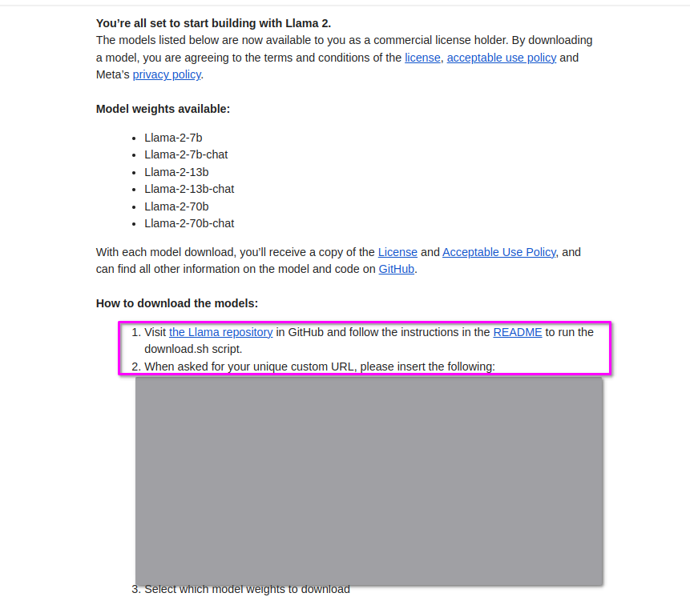
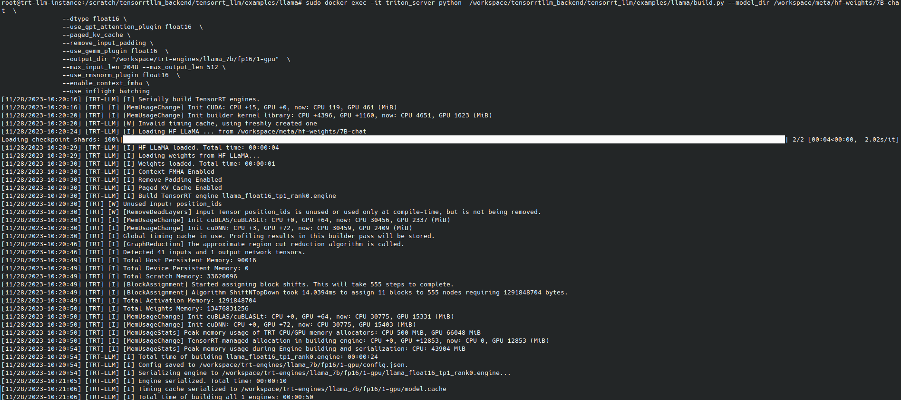
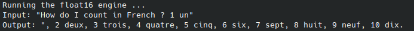

# Model's Preparation

## Weights Download and Preparation
### llama2 downloading
For this tutorial, we will work with Facebook Lama 2 Model.
1. Generate a download llama link
   - Connect to the [llama website](https://ai.meta.com/llama/) using your browser
   - Click on the "Download the Model" button
   - Fill your information (Take caution about the email as you should receive an email from [noreply@email.meta.com](noreply@email.meta.com)) and validate the form
   - You should receive an email close to the one below with the url for downloading 


2. Retrieve the llama git project which provide scripts to download the models
```
mkdir -p /scratch/meta/llama_models
git  -C /scratch/meta clone https://github.com/facebookresearch/llama.git
```
3. Download the model using the url from the email and the download script
```
cd /scratch/meta/llama_models
../llama/download.sh
```
  - You will be asked for the url you have previously received by mail
  - For this tutorial , we will work with llama 7B , 7B-chat , 70B and 70B-chat (**7B,7B-chat,70B,70B-chat**), but you can download all of them so that you can use them further
4. You should have the following tree folder in your **llama_models** folder depending on which models you have downloaded
```
-rw-rw-r-- 1 ubuntu ubuntu   7020 Jul 15 00:06 LICENSE
-rw-rw-r-- 1 ubuntu ubuntu   4766 Jul 15 00:06 USE_POLICY.md
drwxrwxr-x 2 ubuntu ubuntu   4096 Nov  7 08:43 llama-2-13b
drwxrwxr-x 2 ubuntu ubuntu   4096 Nov  7 09:38 llama-2-13b-chat
drwxrwxr-x 2 ubuntu ubuntu   4096 Nov  7 09:14 llama-2-70b
drwxrwxr-x 2 ubuntu ubuntu   4096 Nov  7 10:08 llama-2-70b-chat
drwxrwxr-x 2 ubuntu ubuntu   4096 Nov  7 08:38 llama-2-7b
-rw-rw-r-- 1 ubuntu ubuntu 499723 Jul 13 22:27 tokenizer.model
-rw-rw-r-- 1 ubuntu ubuntu     50 Jul 13 22:27 tokenizer_checklist.chk
```

### llama2  weights to HF format
For some of our commands, we will need to convert the weights from Meta Checkpoint into Hugging Face Transformers format as explained [here](https://huggingface.co/docs/transformers/main/en/model_doc/llama).

1. Clone the huggingface transformer
```
mkdir -p /scratch/huggingface
git -C /scratch/huggingface clone https://github.com/huggingface/transformers.git
```
2. Run the conversion of **llama-2-7b-chat** by using the **Triton server image created before** as it contains all the python dependencies required for the process. 
```
cp /scratch/meta/llama_models/tokenizer.model  /scratch/meta/llama_models/llama-2-7b-chat/tokenizer.model
 docker run s                                      \
        --runtime=nvidia                                \
        --gpus all                                      \
        -it --rm                                        \
        --net host --shm-size=2g                        \
        --ulimit memlock=-1 --ulimit stack=67108864     \
        -v /scratch:/workspace                          \
        tritonserver-aipulse:23.10  python /workspace/huggingface/transformers/src/transformers/models/llama/convert_llama_weights_to_hf.py \
        --input_dir /workspace/meta/llama_models/llama-2-7b-chat \
        --model_size 7B \
        --output_dir /workspace/meta/hf-weights/7B-chat
```
3. The same with the **llama-2-70b** one 
```
cp /scratch/meta/llama_models/tokenizer.model  /scratch/meta/llama_models/llama-2-70b/tokenizer.model
 docker run                                       \
        --runtime=nvidia                                \
        --gpus all                                      \
        -it --rm                                        \
        --net host --shm-size=2g                        \
        --ulimit memlock=-1 --ulimit stack=67108864     \
        -v /scratch:/workspace                          \
        tritonserver-aipulse:23.10  python /workspace/huggingface/transformers/src/transformers/models/llama/convert_llama_weights_to_hf.py \
        --input_dir /workspace/meta/llama_models/llama-2-70b \
        --model_size 70B \
        --output_dir /workspace/meta/hf-weights/70B
```

 We copy first the **tokenizer.model** to be aligned with structure needed by the converter.
You can use 'docker logs' to fetch your temporary container log and check that everything run well.


## TRT LLM compilation

As shown above, we have downloaded a trained llama2 model , then converted the weights to huggingface format for further usage and now we need to build the llama2 models.

### Compile Engines for Llama 2 models
For this step, we will use script provided  in TRT-LLM from the [official github repository](https://github.com/NVIDIA/TensorRT-LLM).

 We have already cloned this repository and the source could be found at  **/scratch/tensorrtllm_backend/tensorrt_llm**.

1. Open the folder containing the scripts
```
cd /scratch/tensorrtllm_backend/tensorrt_llm/examples/llama/
```
2. Install python dependencies
```
pip install -r requirements.txt
```
3. Run the `build.py` script to compile the TRT-LLM engines.
```
 docker run -d                                      \
        --runtime=nvidia                                \
        --gpus all                                      \
        -it --rm                                        \
        --net host --shm-size=2g                        \
        --ulimit memlock=-1 --ulimit stack=67108864     \
        -v /scratch:/workspace                          \
        tritonserver-aipulse:23.10                      \
        python  /workspace/tensorrtllm_backend/tensorrt_llm/examples/llama/build.py  \
        --model_dir /workspace/meta/hf-weights/7B-chat  \
        --dtype float16 \
        --use_gpt_attention_plugin float16  \
        --paged_kv_cache \
        --remove_input_padding \
        --use_gemm_plugin float16  \
        --output_dir "/workspace/trt-engines/llama_7b/fp16/1-gpu"  \
        --max_input_len 2048 --max_output_len 512 \
        --use_rmsnorm_plugin float16  \
        --enable_context_fmha \
        --use_inflight_batching
```

 We also rely here on the **Triton server image created before** as it contains all the python dependencies required for the process.

### Testing
We can test the output of the model with `run.py` located in the same llama examples folder.
```
 docker run                                       \
        --runtime=nvidia                                \
        --gpus all                                      \
        -it --rm                                        \
        --net host --shm-size=2g                        \
        --ulimit memlock=-1 --ulimit stack=67108864     \
        -v /scratch:/workspace                          \
        tritonserver-aipulse:23.10  python  /workspace/tensorrtllm_backend/tensorrt_llm/examples/llama/run.py   --engine_dir=/workspace/trt-engines/llama_7b/fp16/1-gpu \
                --max_output_len 100 \
                --tokenizer_dir /workspace/meta/llama_models \
                --input_text "How do I count in French ? 1 un"
```

