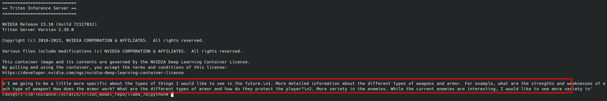
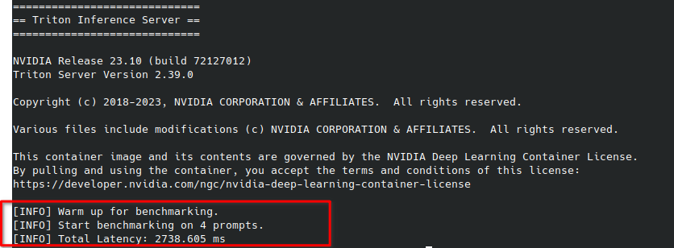
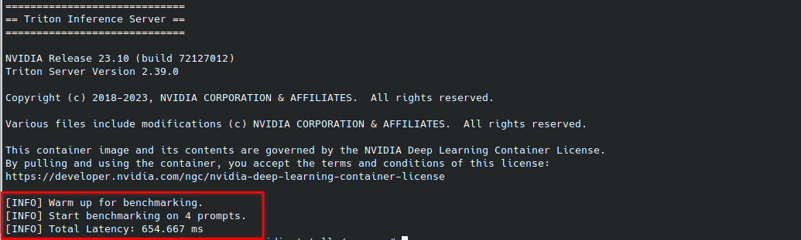

# Serving with Triton Inference Server
## Introduction
The purpose here is to compare performances of the llama2-7b model serve by Triton when it has been optimized using TensorRT-LLM Vs huggingface python one. 
## Models Repository 
Before launching Triton Inference Server, we need to prepare the models repository beforehand and it should respect the structure below. For further details on the model repository in Triton Inference server please refer to this [documentation](https://docs.nvidia.com/deeplearning/triton-inference-server/user-guide/docs/user_guide/model_repository.html).
Model repository are used by the Triton Server to detect model locations.
```
<model-repository-path>/
  <model-name>/
    [config.pbtxt]
    <version>/
      <model-definition-file>
    <version>/
      <model-definition-file>
    ...
  <model-name>/
    [config.pbtxt]
    <version>/
      <model-definition-file>
    <version>/
      <model-definition-file>
    ...
```
## TensorRT-LLM Model - Triton Ensemble
### Overview
An ensemble model represents a pipeline of one or more models and the connection of input and output tensors between those models. Read more about [ensembles](https://docs.nvidia.com/deeplearning/triton-inference-server/user-guide/docs/user_guide/architecture.html#ensemble-models).

Our pipeline for TensorRT-LLM model serving in Triton comprises 4 components :

- `preprocessing`: tokenize the input text (Python Backend)

- `tensorrtllm`: infer the TRTLLM engine (TensorRT- LLM backend)

- `postprocessing`: decode the text output (Python Backend) 

- `ensemble` folder describing the Inputs/Outputs and the sequence of models to call during inference. 

When querying the TensorRT-LLM model, we will query only the "ensemble" which is responsible for all the pipeline. The folder's structure should be similar to the following :

```
triton_model_repo/llama_7b/fp16/no-inflight/
├── ensemble
│   ├── 1
│   └── config.pbtxt
├── postprocessing
│   ├── 1
│   │   └── model.py
│   └── config.pbtxt
├── preprocessing
│   ├── 1
│   │   └── model.py
│   └── config.pbtxt
└── tensorrt_llm
    ├── 1
    └── config.pbtxt
```
### Steps
1. Create the triton model repository that will holds all the triton model 
```
mkdir -p /scratch/triton_model_repo/llama_7b/python
```
2. Initiates the python folder with template files from tensorrtllm_backend
```
cp -R /scratch/tensorrtllm_backend/all_models/inflight_batcher_llm/* /scratch/triton_model_repo/llama_7b/python/.
```
3. Update the preprocessing template values
```
sed -i 's#${tokenizer_dir}#/workspace/meta/llama_models#' /scratch/triton_model_repo/llama_7b/python/preprocessing/config.pbtxt
sed -i 's#${tokenizer_type}#llama#' /scratch/triton_model_repo/llama_7b/python/preprocessing/config.pbtxt
```
4. Update the postprocessing template values
```
sed -i 's#${tokenizer_dir}#/workspace/meta/llama_models#' /scratch/triton_model_repo/llama_7b/python/postprocessing/config.pbtxt
sed -i 's#${tokenizer_type}#llama#' /scratch/triton_model_repo/llama_7b/python/postprocessing/config.pbtxt
```
5. Update the tensorrt_llm template values
```
sed -i 's#${decoupled_mode}#False#' /scratch/triton_model_repo/llama_7b/python/tensorrt_llm/config.pbtxt
sed -i 's#inflight_fused_batching#V1#' /scratch/triton_model_repo/llama_7b/python/tensorrt_llm/config.pbtxt
sed -i 's#${engine_dir}#/workspace/trt-engines/llama_7b/fp16/1-gpu#' /scratch/triton_model_repo/llama_7b/python/tensorrt_llm/config.pbtxt
sed -i 's#${max_tokens_in_paged_kv_cache}##' /scratch/triton_model_repo/llama_7b/python/tensorrt_llm/config.pbtxt
sed -i 's#${batch_scheduler_policy}#guaranteed_completion#' /scratch/triton_model_repo/llama_7b/python/tensorrt_llm/config.pbtxt
```
## Python Model - HF Llama model
### Overview 
We will serve one reference model called *llama_python*, using Hugging Face Text Generation Pipeline and Triton Python Backend.
The Text Generation Pipeline includes the tokenization, the inference on the model and the text decoding process. 

For simplicity in this particular experiment, the `llama-python` folder resides at the same level as the TensorRT-LLM components described above. Thus, the model repository should be similar to the following snippet. But, this is **not** recommended for production runs. 
```
triton_model_repo/llama_7b/python
├── ensemble
├── **llama-python**
├── postprocessing
├── preprocessing
└── tensorrt_llm
```

1. Create the **llama_python** hugging face template folder 
```
mkdir -p /scratch/triton_model_repo/llama_7b/python/llama-python/1
```
2. Add the python's triton model code
```
cp /scratch/ai-pulse-nvidia-trt-llm/sources/triton/model/llama-python/model.py  /scratch/triton_model_repo/llama_7b/python/llama-python/1
```
3. Add the Model configuration
```
cp /scratch/ai-pulse-nvidia-trt-llm/sources/triton/model/llama-python/config.pbtxt  /scratch/triton_model_repo/llama_7b/python/llama-python/config.pbtxt
```

## Inferencing using Triton Inference Server
### Triton Server
#### Setup 
1. We use the docker command below to run the container based on the model repository created above
```
sudo docker run   -d                                    \
        --runtime=nvidia                                \
        --gpus all                                      \
        -it --rm                                        \
        --net host --shm-size=2g                        \
        --ulimit memlock=-1 --ulimit stack=67108864     \
        --name triton_server_benchmark                \
        -v /scratch:/workspace                          \
        tritonserver-aipulse:23.10 tritonserver --model-repository=/workspace/triton_model_repo/llama_7b/python
```
**NB**:
If you built the engine with `--world_size X` where `X` is greater than 1, you will need to use the [launch_triton_server.py](https://github.com/triton-inference-server/tensorrtllm_backend/blob/release/0.5.0/scripts/launch_triton_server.py) script.

2. You can follow your container log using the command below ,  The server is ready when all the models' status are `READY`. The output should be similiar to this screenshot below : 
```
sudo docker logs triton_server_benchmark -f
```


#### Validation
We will rely on the [client docker image](01-setup.md#client) we have previously build.We will use the provided client script [end_to_end_streaming_client.py](../sources/benchmark/scripts/end_to_end_streaming_client.py) to send requests to our server using the Python and TensorRT-LLM models.


### Send Requests from a Client
```
sudo docker run                                        \
        --runtime=nvidia                                \
        -it --rm                                        \
        --net host --shm-size=2g                        \
        --ulimit memlock=-1 --ulimit stack=67108864     \
        --name triton_client                            \
        -v /scratch:/workspace                          \
        tritonclient-aipulse:23.10 python /usr/local/src/benchmark/scripts/end_to_end_streaming_client.py -u localhost:8001 --model_name llama-python --max_tokens 100  --prompt "I am going to"
```
 The -u option allows to specify the url of our server endpoint (Triton natively exposes grpc and HTTP respectively on 8001 and 8000).



## Benchmark
### CNN Dailymail Dataset
In this section, we compare both model's performance on a subset of the [CNN Dailymail Dataset](https://huggingface.co/datasets/cnn_dailymail).We rely on [MLPerf Inference Benchmark Suite](https://github.com/mlcommons/inference/tree/master/language/gpt-j)) to download and generate `cnn_eval.json` file that will serve as input following these steps.

1. Clone the repository
```
git -C /scratch clone https://github.com/mlcommons/inference.git
```
2. Install required dependencies
```
cd /scratch/inference/language/gpt-j
pip install simplejson datasets transformers
```
3. Download dataset
```
python3 download_cnndm.py
```
4. Extract a subset  using jq 
```
mkdir /scratch/datasets
cat /scratch/inference/language/gpt-j/data/cnn_eval.json | jq '.[0:100]' > /scratch/datasets/mini_cnn_eval.json
```

The truncated  `mini_cnn_eval.json` should have the following structure.

```
[
  {
      "input": "(CNN)Share, and your gift will be multiplied. That may sound like an esoteric adage, but when Zully Broussard selflessly decided to give one of her kidneys to a stranger, her generosity paired up with big data. It resulted in six [...] "",
      "instruction": "Summarize the following news article:",
      "output": "Zully Broussard decided to give a kidney to a stranger .\nA new computer program helped her donation spur transplants for six kidney patients ."
  },
  ....
]    
```

### Performance Testing
The [Identity Test Python VS TRT LLM script](../sources/benchmark/scripts/identity_test_python_vs_trtllm.py) will measure the total latency on multiple asynchronous request sent to the models 

#### Launch on Python backend
```
sudo docker run                                        \
        --runtime=nvidia                                \
        -it --rm                                        \
        --net host --shm-size=2g                        \
        --ulimit memlock=-1 --ulimit stack=67108864     \
        --name triton_client                            \
        -v /scratch:/workspace                          \
        tritonclient-aipulse:23.10 python /usr/local/src/benchmark/scripts/identity_test_python_vs_trtllm.py -u localhost:8001 --max_input_len 100 --dataset /workspace/datasets/mini_cnn_eval.json -i grpc --model_name "llama-python"
```


 We can see here than the targeted model on the inference server is the **llama-python** which correspond to the python backend.

#### Launch on TensorRT-LLM ensemble
```
sudo docker run                                        \
        --runtime=nvidia                                \
        -it --rm                                        \
        --net host --shm-size=2g                        \
        --ulimit memlock=-1 --ulimit stack=67108864     \
        --name triton_client                            \
        -v /scratch:/workspace                          \
        tritonclient-aipulse:23.10 python /usr/local/src/benchmark/scripts/identity_test_python_vs_trtllm.py -u localhost:8001 --max_input_len 100 --dataset /workspace/datasets/mini_cnn_eval.json -i grpc --model_name "ensemble"
```

 We can see here than the targeted model on the inference server is the **ensemble** which correspond to the TensorRT-LLM optimized one.

As We can see here , the Tensor TRT optimized has better performance than the non optimized one.
The speedup when TensorRT-LLM is used compared to the Python baseline in our example is **3**. We still can improve this speedup with other optimizations. 


## Next Step
### Cleanup
```
sudo docker container stop triton_server_benchmark
```
[Parallelism in TensorRT-LLM](04_Parallelism.md)