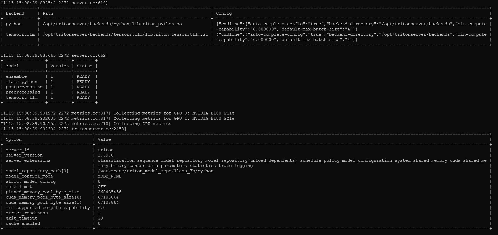

# Parallelism in TensorRT-LLM
## Introduction
Large Language Models can be huge and the GPU RAM can be a limitation. 
[Pipeline and Tensor Parallelism (PP and TP)](https://colossalai.org/docs/concepts/paradigms_of_parallelism) are efficient ways to workaround the memory limitation on a single GPU as they split the model into parts at training and inference time and distribute them among multiple GPUs. 

The purpose of this part is to show it in action on Llama-70B (130GB for the model's weights only) using our instance with 2 H100-80GB GPUs.

|  Parameter |Description   |
|---|---|
|  pp_size | Pipeline Parallelism size  |
| tp_size  | Tensor Parallelism size  |
| world_size  | Represents the number of parts you have using PP=2 and TP=2, the world size is equal to 4. |

## Build

### Pipeline Parallelism
We need the build command again, and add `--world_size` and `--pp_size` parameters. 

Note: We need some more parameters here, because of PP using some more GPU memory than just the half of the model size. 
As we are already almost using the full GPU, it won't be possible to fit on the H100 80G. 

We will use `fp8` quantization to reduce the model size, see more in the [quantization](./06_quantization.md) section.

1. Run the `build.py` script to compile the TRT-LLM engines.
```
 docker run                                       \
        --runtime=nvidia                                \
        --gpus all                                      \
        -it --rm                                        \
        --net host --shm-size=2g                        \
        --ulimit memlock=-1 --ulimit stack=67108864     \
        -v /scratch:/workspace                          \
        tritonserver-aipulse:23.10   python  /workspace/tensorrtllm_backend/tensorrt_llm/examples/llama/build.py \
         --model_dir /workspace/meta/hf-weights/70B \
         --dtype float16 \
         --use_gpt_attention_plugin float16 \
         --use_gemm_plugin float16 \
         --use_rmsnorm_plugin float16 \
         --use_inflight_batching \
         --remove_input_padding \
         --enable_context_fmha \
         --enable_fp8 \
         --fp8_kv_cache \
         --paged_kv_cache \
         --max_input_len 2048 --max_output_len 512 \
         --output_dir /workspace/trt-engines/llama_70b/fp8/pp/2-gpu \
         --world_size 2 \
         --pp_size 2
```
As a result, we have 2 engines with half the size **of the original FP8** full model.
```
ls -lrtsh  /scratch/trt-engines/llama_70b/fp8/pp/2-gpu/
```
```
total 65G
4,0K -rw-r--r-- 1 root root 1,3K déc.  27 15:37 config.json
 33G -rw-r--r-- 1 root root  33G déc.  27 15:38 llama_float16_tp1_pp2_rank0.engine
 33G -rw-r--r-- 1 root root  33G déc.  27 16:06 llama_float16_tp1_pp2_rank1.engine
236K -rw-r--r-- 1 root root 236K déc.  27 16:06 model.cache
```
**This operation could take up to 40 mn.**

### Tensor Parallelism
This time build command will be modified adding `--world_size` and `--tp_size` parameters.
```
 docker run                                       \
        --runtime=nvidia                                \
        --gpus all                                      \
        -it --rm                                        \
        --net host --shm-size=2g                        \
        --ulimit memlock=-1 --ulimit stack=67108864     \
        -v /scratch:/workspace                          \
        tritonserver-aipulse:23.10   python  /workspace/tensorrtllm_backend/tensorrt_llm/examples/llama/build.py \
         --model_dir /workspace/meta/hf-weights/70B \
         --dtype float16 \
         --use_gpt_attention_plugin float16 \
         --use_gemm_plugin float16 \
         --use_rmsnorm_plugin float16 \
         --use_inflight_batching \
         --remove_input_padding \
         --enable_context_fmha \
         --paged_kv_cache \
         --max_input_len 2048 --max_output_len 512 \
         --output_dir /workspace/trt-engines/llama_70b/fp16/tp/2-gpu \
        --world_size 2 \
        --tp_size 2
```

As a result, we have 2 engines with half the size **of the original full model**. 
```
ls -lrtsh  /scratch/trt-engines/llama_70b/fp16/tp/2-gpu
```

```
total 129G
4,0K -rw-r--r-- 1 root root 1,3K déc.  27 16:18 config.json
 65G -rw-r--r-- 1 root root  65G déc.  27 16:20 llama_float16_tp2_rank0.engine
 65G -rw-r--r-- 1 root root  65G déc.  27 16:26 llama_float16_tp2_rank1.engine
 48K -rw-r--r-- 1 root root  47K déc.  27 16:26 model.cache
```

**This operation could take up to 40 mn.**

## Serve
### Using TensorRT-LLM run script
We will serve here the previous tensor parrallelism model using TensorRT LLM script

```
 docker run                                       \
        --runtime=nvidia                                \
        --gpus all                                      \
        -it --rm                                        \
        --net host --shm-size=2g                        \
        --ulimit memlock=-1 --ulimit stack=67108864     \
        -v /scratch:/workspace                          \
        tritonserver-aipulse:23.10 mpirun -n 2 --allow-run-as-root python3 /workspace/tensorrtllm_backend/tensorrt_llm/examples/llama/run.py \
        --engine_dir=/workspace/trt-engines/llama_70b/fp16/tp/2-gpu --max_output_len 200 \
        --tokenizer_dir /workspace/meta/hf-weights/70B \
        --input_text "How do I count in French? 1 un "
```
Below the results :
```
Output: "2 deux 3 trois 4 quatre 5 cinq 6 six 7 sept 8 huit 9 neuf 10 dix 11 onze 12 douze 13 treize 14 quatorze 15 quinze 16 seize 17 dix-sept 18 dix-huit 19 dix-neuf 20 vingt 21 vingt et un 22 vingt-deux 23 vingt-trois 24 vingt-quatre 25 vingt-cinq 26 vingt-six 27 vingt-sept 28 vingt-huit 29 vingt-neuf 30 trente 31 trente et un 32 trente-deux 33 trente-trois 34 trente-quatre 35 trente-"
```


### Using Triton Inference server


#### Create the Triton Server Model
The whole process has been previously done [here](03-Triton.md#models-repository).
Now we need to do the same to run triton upon one of our parallelized model.

1. Create the triton model repository that will holds all the triton model 
```
mkdir -p /scratch/triton_model_repo/llama_70b/fp8/pp/2-gpu
```
2. Initiates the python folder with template files from tensorrtllm_backend
```
cp -R /scratch/tensorrtllm_backend/all_models/inflight_batcher_llm/* /scratch/triton_model_repo/llama_70b/fp8/pp/2-gpu/.
```
3. Update the preprocessing template values
```
sed -i 's#${tokenizer_dir}#/workspace/meta/llama_models#' /scratch/triton_model_repo/llama_70b/fp8/pp/2-gpu/preprocessing/config.pbtxt
sed -i 's#${tokenizer_type}#llama#' /scratch/triton_model_repo/llama_70b/fp8/pp/2-gpu/preprocessing/config.pbtxt
```
4. Update the postprocessing template values
```
sed -i 's#${tokenizer_dir}#/workspace/meta/llama_models#' /scratch/triton_model_repo/llama_70b/fp8/pp/2-gpu/postprocessing/config.pbtxt
sed -i 's#${tokenizer_type}#llama#' /scratch/triton_model_repo/llama_70b/fp8/pp/2-gpu/postprocessing/config.pbtxt
```
5. Update the tensorrt_llm template values
```
sed -i 's#${decoupled_mode}#False#' /scratch/triton_model_repo/llama_70b/fp8/pp/2-gpu/tensorrt_llm/config.pbtxt
sed -i 's#${engine_dir}#/workspace/trt-engines/llama_70b/fp8/pp/2-gpu#' /scratch/triton_model_repo/llama_70b/fp8/pp/2-gpu/tensorrt_llm/config.pbtxt
sed -i 's#${max_tokens_in_paged_kv_cache}##' /scratch/triton_model_repo/llama_70b/fp8/pp/2-gpu/tensorrt_llm/config.pbtxt
sed -i 's#${batch_scheduler_policy}#guaranteed_completion#' /scratch/triton_model_repo/llama_70b/fp8/pp/2-gpu/tensorrt_llm/config.pbtxt
```

#### Run the Triton Inference server
We will use the "launch_triton_server.py" provided as part of TensorRT-LLM backends (NB: We specify here the world_size=2).
1. Open a new SSH Terminal to your server
```
docker run                                       \
        --runtime=nvidia                                \
        --gpus all                                      \
        -it --rm                                        \
        --net host --shm-size=2g                        \
        --ulimit memlock=-1 --ulimit stack=67108864     \
        -v /scratch:/workspace                          \
        -d                                              \
        --name triton_server_parallelism                \
        tritonserver-aipulse:23.10  bash
```
2. Connect to your docker container
```
docker exec -it triton_server_parallelism bash
```

3. Run the python server using the script
```
python /workspace/tensorrtllm_backend/scripts/launch_triton_server.py --world_size=2 --model_repo=/workspace/triton_model_repo/llama_70b/fp8/pp/2-gpu
```
4. Wait for the server to be up


#### Test with Triton client
1. Open a new SSH Terminal to your server
2. Here we will run a simple client prompt and get the result using the script [inflight_batcher_llm_client.py](https://github.com/triton-inference-server/tensorrtllm_backend/blob/release/0.5.0/inflight_batcher_llm/client/inflight_batcher_llm_client.py) available on TensorRT-LLM Backend github.
```
docker run                                       \
        --runtime=nvidia                                \
        --gpus all                                      \
        -it --rm                                        \
        --net host --shm-size=2g                        \
        --ulimit memlock=-1 --ulimit stack=67108864     \
        -v /scratch:/workspace                          \
        --name triton_client_parallelism                \
        tritonclient-aipulse:23.10 python /workspace/tensorrtllm_backend/inflight_batcher_llm/client/inflight_batcher_llm_client.py \
    -u localhost:8001 \
    --tokenizer_dir /workspace/meta/hf-weights/70B \
    --request-output-len 200 \
    --text "How do I count in French ? 1 un "
```
3. The output should look like the following
```
None of PyTorch, TensorFlow >= 2.0, or Flax have been found. Models won't be available and only tokenizers, configuration and file/data utilities can be used.
=========
Got completed request
output_ids =  [[1, 1128, 437, 306, 2302, 297, 5176, 1577, 29871, 29896, 443, 29871, 29906, 4239, 29871, 29941, 7732, 29871, 29946, 12134, 29871, 29945, 17256, 29871, 29953, 4832, 29871, 29955, 4843, 29871, 29947, 27052, 29871, 29929, 452, 1137, 29871, 29896, 29900, 23386, 29871, 29896, 29896, 373, 911, 29871, 29896, 29906, 4662, 911, 29871, 29896, 29941, 2578, 675, 29871, 29896, 29946, 439, 1061, 911, 29871, 29896, 29945, 439, 262, 911, 29871, 29896, 29953, 409, 675, 29871, 29896, 29955, 23386, 29899, 344, 415, 29871, 29896, 29947, 23386, 29899, 29882, 3121, 29871, 29896, 29929, 23386, 29899, 484, 1137, 29871, 29906, 29900, 325, 19680, 29871, 29906, 29896, 325, 19680, 634, 443, 29871, 29906, 29906, 325, 19680, 29899, 311, 1314, 29871, 29906, 29941, 325, 19680, 29899, 29873, 307, 275, 29871, 29906, 29946, 325, 19680, 29899, 339, 6064, 29871, 29906, 29945, 325, 19680, 29899, 16381, 29939, 29871, 29906, 29953, 325, 19680, 29899, 28319, 29871, 29906, 29955, 325, 19680, 29899, 344, 415, 29871, 29906, 29947, 325, 19680, 29899, 29882, 3121, 29871, 29906, 29929, 325, 19680, 29899, 484, 1137, 29871, 29941, 29900, 534, 2016, 29871, 29941, 29896, 534, 2016, 634, 443, 29871, 29941, 29906, 534, 2016, 29899, 311, 1314, 29871, 29941, 29941, 534, 2016, 29899, 29873, 307, 275, 29871, 29941, 29946, 534, 2016, 29899, 339, 6064, 29871, 29941, 29945, 534, 2016, 29899]]
Input: How do I count in French ? 1 un
Output: 2 deux 3 trois 4 quatre 5 cinq 6 six 7 sept 8 huit 9 neuf 10 dix 11 onze 12 douze 13 treize 14 quatorze 15 quinze 16 seize 17 dix-sept 18 dix-huit 19 dix-neuf 20 vingt 21 vingt et un 22 vingt-deux 23 vingt-trois 24 vingt-quatre 25 vingt-cinq 26 vingt-six 27 vingt-sept 28 vingt-huit 29 vingt-neuf 30 trente 31 trente et un 32 trente-deux 33 trente-trois 34 trente-quatre 35 trente-

```


## Next Steps
### Cleanup
- Kill the SSH session with the inference server running and kill the container
```
docker container  stop triton_server_parallelism
```
[Batch Scheduling](05-scheduling.md)